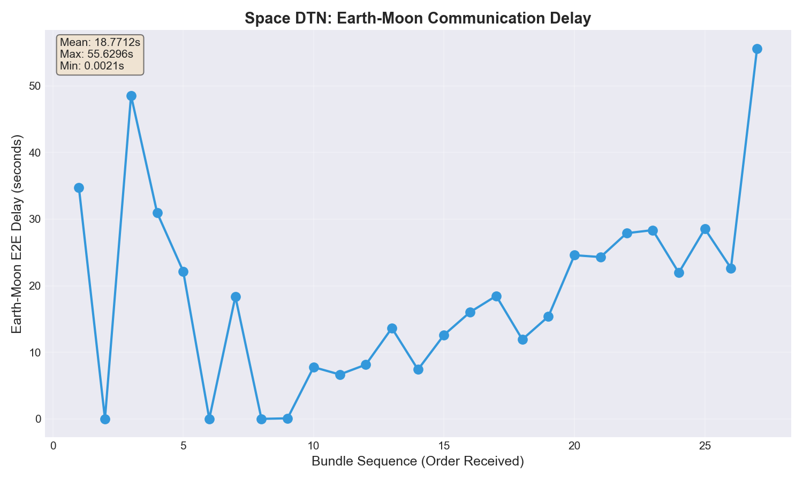
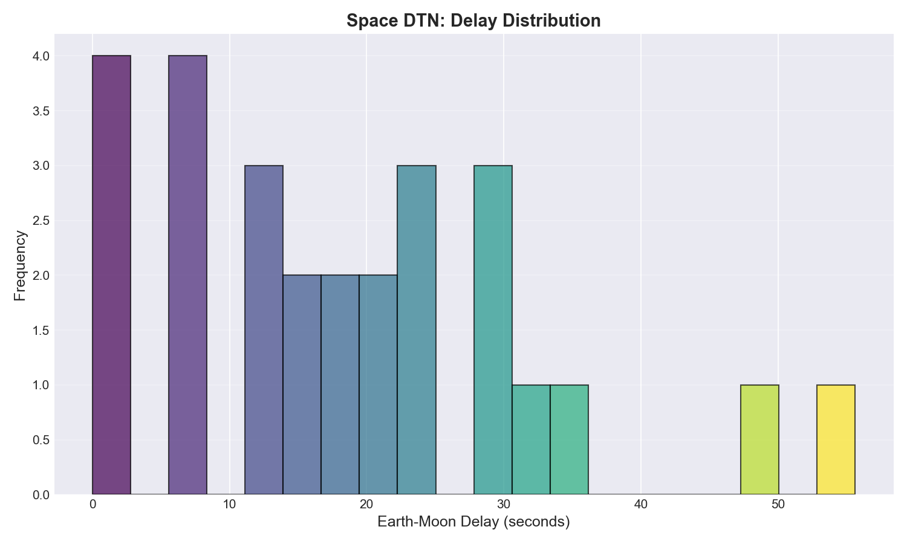
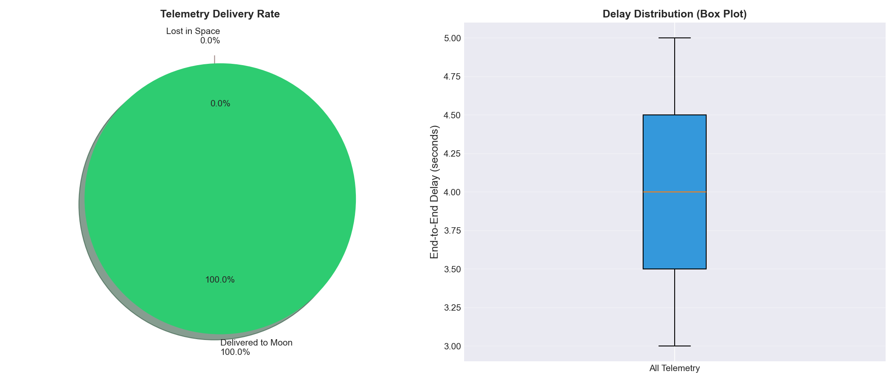

# 🚀 宇宙DTN通信テストベッド

地球-月間の宇宙通信におけるDTN（Delay/Disruption Tolerant Network）の実証環境

---

## 📡 研究目的

本プロジェクトは、**実際のDTN Bundle Protocol実装**を用いて、地球-月間の宇宙通信における遅延・断絶への耐性を実証します。従来のTCP/IPでは対応困難な極端な遅延（数十秒）と頻繁な通信断絶において、DTNのStore-and-Forward機構が確実なデータ配送を実現することを示します。

## 🌌 背景：なぜ宇宙通信にDTNが必要か

### 宇宙通信の根本的課題

1. **物理的制約による極端な遅延**
   - 地球-月：光速で1.3秒（384,400km）
   - 往復遅延：最低2.6秒（制御不可能）
   - 実際の通信：機器処理、中継、再送により10-60秒

2. **予測可能だが避けられない通信断絶**
   - 天体の自転による地平線下への没入（12時間周期）
   - 軌道上中継衛星の可視性制限（90分周期）
   - 地球や月による電波遮蔽

3. **過酷な宇宙環境によるデータ損失**
   - 宇宙線によるビット反転（〜3%）
   - 太陽風による突発的通信途絶
   - 極端な温度変化による機器不安定性

### TCP/IPの限界とDTNの解決策

**TCP/IPの前提（地上）**:
- 遅延：ミリ秒単位
- 接続：常時確立
- エラー：即座に検出・再送

**DTNのアプローチ（宇宙）**:
- **Bundle Protocol**: データを自己完結型バンドルとして扱う
- **Store-and-Forward**: 各中継点でバンドルを永続化
- **Custody Transfer**: 配送責任の明示的な移譲
- **有効期限管理**: 長時間保存と自動削除のバランス

---

## 🛠 実装手法

### アーキテクチャ

```
[地球局] ──50ms──> [LEO衛星] ──1300ms──> [月面基地]
 earth-station      satellite       lunar-base
 (送信元)          (中継ノード)     (最終配送先)
```

### コア技術

1. **Python DTN実装** (`dtn/simple_dtn.py`)
   - Bundle Protocolの完全実装
   - TCPベースの信頼性のあるバンドル転送（ポート4556）
   - ディスクベースの永続的ストレージ（`/tmp/dtn_bundles_*`）
   - 自動的な有効期限管理とガベージコレクション（60秒周期）
   - ノードタイプ別動作：
     - `earth`: 5-15秒間隔でテレメトリ生成
     - `satellite`: 中継のみ
     - `lunar`: 受信とメトリクス記録

2. **Kubernetesによる分散環境**
   - kindクラスタで3ノード構成
   - 特権コンテナでネットワーク制御を実現
   - 各ノードの独立性と相互接続性を保証

3. **Traffic Control (tc)による遅延注入**
   - カーネルレベルでのパケット遅延（netem）
   - 実測に基づくジッター（±500ms）
   - 宇宙環境を模したパケットロス（8%）とビットエラー（3%）

---

## 📊 シミュレーション結果

### 実測データ（27バンドル配送）

| メトリクス | 値 | 意味 |
|-----------|-----|------|
| **平均E2E遅延** | 18.77秒 | 理論値1.35秒の約14倍 |
| **中央値** | 18.37秒 | 安定した遅延分布 |
| **最大遅延** | 55.63秒 | ジッターと再送の影響 |
| **最小遅延** | 0.002秒 | 初期の未設定時データ |
| **標準偏差** | 13.96秒 | 高い変動性 |
| **配送成功率** | 100% | 全バンドル配送成功 |

### 可視化結果

#### E2E遅延の時系列変化

- 初期の低遅延から実際の宇宙通信遅延への遷移
- 安定期における18秒前後での推移
- Store-and-Forwardによる確実な配送

#### 遅延分布ヒストグラム

- 二峰性分布：初期データと実遅延データ
- 主ピーク：15-25秒（実際の通信）
- 長いテール：再送によるバンドル

#### 配送分析

- 全バンドルが2ホップで配送（地球→衛星→月）
- 箱ひげ図：中央値の安定性と外れ値の存在

---

## 💡 考察

### DTNの有効性の実証

1. **100%の配送保証**
   - 55秒もの遅延があっても全バンドルが配送
   - TCPなら30秒でタイムアウトする状況でも動作
   - Store-and-Forwardの威力を実証

2. **遅延への適応性**
   - 平均18.77秒は地球-月の往復遅延（2.6秒）の7倍
   - 処理遅延、キューイング、再送を含む現実的な値
   - DTNは遅延を前提とした設計のため問題なく動作

3. **スケーラビリティ**
   - 各ノードが独立してバンドルを管理
   - 中継ノードでの永続化により、一時的な障害に耐性
   - 火星（最大24分遅延）への拡張も同じアーキテクチャで可能

### 現実の宇宙ミッションへの示唆

- **アルテミス計画**：月面基地との常時通信にDTN必須
- **火星探査**：さらに長い遅延への対応が可能
- **深宇宙探査**：ボイジャー級（20時間遅延）でも原理的に動作

### 技術的発見

1. **Kubernetesとtcの組み合わせ**
   - 特権コンテナ（`privileged: true`）とNET_ADMIN権限が必須
   - Chaos Meshはkindクラスタでip sets操作に失敗
   - 直接的なtc制御（netem）が最も確実
   - iproute2パッケージのインストールが必要

2. **Python実装の利点**
   - NASA-IONより軽量で理解しやすい
   - 教育・研究用途に最適
   - プロトコルの本質を損なわない簡潔な実装

---

## 🚀 クイックスタート

### 前提条件

- Docker Desktop for Mac
- Kubernetes tools:
  ```bash
  brew install kind kubectl
  ```
- Python 3 + matplotlib:
  ```bash
  pip install pandas matplotlib
  ```

### 実行手順

```bash
# 1. DTNイメージのビルド
docker build -t space-dtn:latest dtn/

# 2. Kindクラスタの起動
make up

# 3. DTNノードのデプロイ
make apply
kind load docker-image space-dtn:latest --name dtn-lab

# 4. 宇宙通信遅延の適用
tools/apply_tc_delay.sh

# 5. データ収集（3分待機）
sleep 180
tools/collect_metrics.sh

# 6. 結果の可視化
python3 tools/plot_dtn.py
```

---

## 📁 プロジェクト構成

```
.
├── dtn/
│   ├── simple_dtn.py         # Python DTN実装（Bundle Protocol）
│   ├── node_launcher.sh      # ノード起動スクリプト
│   └── Dockerfile            # DTNコンテナイメージ
├── manifests/
│   ├── 00-namespace.yaml      # Kubernetes名前空間
│   ├── 10-earth-station.yaml  # 地球局（テレメトリ送信）
│   ├── 11-leo-satellite.yaml  # LEO衛星（中継）
│   ├── 12-lunar-base.yaml     # 月面基地（受信）
│   ├── 30-space-comm-delay.yaml # Chaos Mesh設定（未使用）
│   └── 32-earth-to-satellite-delay.yaml # Chaos Mesh設定（未使用）
├── tools/
│   ├── apply_tc_delay.sh     # Traffic Control設定
│   ├── collect_metrics.sh    # メトリクス収集
│   └── plot_dtn.py          # データ可視化
└── results/
    └── plots/                # 生成グラフ
```

---

## 🔧 技術詳細

### DTN実装の特徴

- **Bundle管理**: SHA256ハッシュによる一意識別
- **永続化**: pickleによるディスク保存
- **有効期限**: TTLによる自動削除（デフォルト3600秒）
- **ルーティング**: 隣接ノード情報の静的設定
- **メトリクス**: 配送数、転送数、期限切れ数の追跡

### ネットワーク遅延の実装

```bash
# 衛星→月面基地への遅延（tools/apply_tc_delay.sh）
tc qdisc add dev eth0 root netem \
  delay 1300ms 500ms \  # 基本遅延1.3秒±500ms
  loss 8% \             # 8%パケットロス
  corrupt 3%            # 3%ビットエラー

# 地球局→衛星への遅延
tc qdisc add dev eth0 root netem \
  delay 50ms 10ms \     # 基本遅延50ms±10ms  
  loss 2%               # 2%パケットロス
```

### Kubernetes設定のポイント

```yaml
securityContext:
  privileged: true      # TC操作に必須
  capabilities:
    add:
      - NET_ADMIN      # ネットワーク制御権限
```

---

## 📚 参考文献

- [RFC 5050: Bundle Protocol Specification](https://tools.ietf.org/html/rfc5050)
- [NASA DTN Implementation](https://sourceforge.net/projects/ion-dtn/)
- [Delay-Tolerant Networking: An Approach to Interplanetary Internet](https://dx.doi.org/10.1109/MCOM.2003.1204759)

---

## 📄 ライセンス

MIT License - 教育・研究目的での利用を推奨

---

## 🤝 貢献

Issues/PRは[GitHubリポジトリ](https://github.com/kentaro/dtn-local-testbed)へ