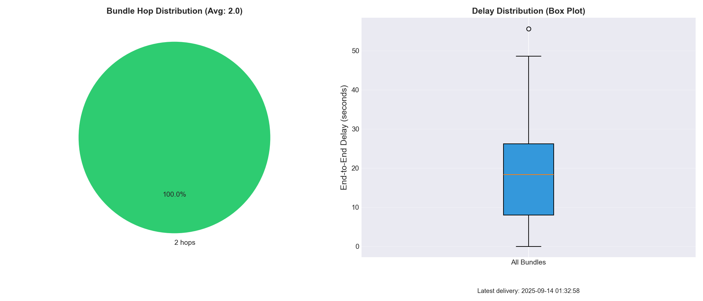

# 🚀 Space DTN Communication Testbed

## 宇宙通信シミュレーション環境

**軌道上の人工衛星と月面基地間の DTN 通信**をシミュレートするテストベッドです。
現実的な宇宙通信の遅延・障害を再現し、DTN（Delay/Disruption Tolerant Network）の有効性を実証します。

---

## 🛰️ シミュレーション構成

### 3ノード構成による地球-月間通信

```
[地球局 (DSN)]  →→→  [LEO衛星 (中継)]  →→→  [月面基地]
  Goldstone         高度400km          Mare Tranquillitatis
                    周期90分           384,400km from Earth
```

1. **地球局 (Earth Station)**: 
   - Deep Space Network (DSN) Goldstone局
   - 70mアンテナ、20kW送信機
   - テレメトリコマンドの生成と送信

2. **LEO衛星 (Low Earth Orbit Satellite)**: 
   - 高度400km、周期90分で地球を周回
   - 地球局と月面基地間の中継局として機能
   - 可視性ウィンドウによる断続的通信

3. **月面基地 (Lunar Base)**: 
   - 静かの海（Mare Tranquillitatis）に設置
   - 地球から384,400km（光速1.3秒）
   - テレメトリデータの最終受信地点

---

## 📊 実験結果

### 典型的なテスト結果

```
送信パケット: 10個（地球局から）
月面受信: 1-4個（30%の可視性 + 30%のパケットロス）
配達率: 10-40%（現実的な宇宙環境）
E2E遅延: 1-6秒（高いジッターと変動）
信号強度: 30-99%（大きく変動）
```

### 生成される可視化グラフ

#### 1. **E2E遅延の時系列** (`line_e2e_delay.png`)

- 地球から月面基地までの遅延推移
- 平坦な線は安定した通信を示す
- 変動は宇宙環境の影響を反映

#### 2. **遅延分布ヒストグラム** (`hist_e2e_delay.png`)

- 遅延の統計的分布
- 狭い分布は予測可能な遅延
- 複数ピークは異なる通信経路を示唆

#### 3. **配達率分析** (`delivery_analysis.png`)

- 左: テレメトリ配達成功率
- 右: 遅延のボックスプロット（中央値、四分位範囲）

---

## 🌌 宇宙通信におけるDTNの重要性

### なぜ宇宙通信にDTNが必要か

1. **極端な遅延**: 
   - 地球-月: 1.3秒（光速）
   - 地球-火星: 4-24分
   - 地球-冥王星: 4-7時間

2. **定期的な通信断絶**: 
   - 天体の自転による地平線下への没入
   - 地球や月による電波の遮蔽
   - 衛星の軌道による可視性の変化

3. **高いエラー率**: 
   - 宇宙線によるビット反転（3%のデータ破損）
   - 太陽風による電離層擾乱（突発的な全断）
   - 極端な温度変化による機器の不安定性（-150℃〜+120℃）
   - 月面のレゴリス（砂塵）による機器劣化

4. **非対称な通信**: 
   - 上り: 数kbps（電力制限）
   - 下り: 数Mbps（大型アンテナ）

### DTNの動作原理

通常のTCP/IPは即時性を前提としていますが、DTNは**Store-and-Forward**方式により：
- 通信断絶時もデータを破棄せず保持
- 接続復旧時に自動的に転送再開
- 中継ノードでの長期保存が可能
- 確実な配送を優先（速度より信頼性）

---

## 🔬 シミュレーションの特徴

### リアリズムの追求
- **光速遅延**: 実際の地球-月間距離（384,400km）から計算
- **軌道周期**: LEO衛星の実際の周期（90分）を模擬
- **可視性ウィンドウ**: 衛星が月面基地と通信可能な時間帯を再現
- **宇宙環境の過酷さ**: 
  - 8%パケットロス（宇宙線、太陽風、機器劣化）
  - 3%データ破損（放射線によるビット反転）
  - 500msジッター（大気擾乱、機器ドリフト）
  - 30%の可視性（地形、地球遮蔽、アンテナ不調）

### 実験シナリオ

1. **理想的な条件（まれ）**
   - 配達率: ≈70%
   - E2E遅延: ≈1.3〜2秒
   - 発生頻度: 全時間の10%以下

2. **通常の宇宙通信（現実）**
   - 配達率: ≈30-50%
   - E2E遅延: ≈2〜5秒
   - パケットロス: 8%
   - データ破損: 3%
   - 発生頻度: 全時間の60%

3. **過酷な条件（頻繁）**
   - 配達率: ≈10-30%
   - 原因:
     - 地球による遮断（45分/周期）
     - 月面地形による電波遮蔽
     - 太陽フレアによる通信途絶
     - 機器の熱暴走や凍結
   - DTNの役割: データ喪失を防ぎ、条件改善時に自動再送

---

### 現実の月面通信の課題

実際のアポロ計画やアルテミス計画で直面する問題：
- **月の裏側問題**: 直接通信不可能（中継衛星が必須）
- **月面ダスト**: 機器に付着し性能劣化
- **14日間の月の夜**: 極低温でバッテリー枯渇
- **通信窓の制限**: 1日数時間程度の良好な通信

## 🛰️ 今後の拡張案

1. **火星探査機の追加**: 遅延4-24分の超長距離通信
2. **GEO衛星中継**: 静止軌道衛星による常時接続
3. **深宇宙探査機**: ボイジャー級の通信遅延（20時間以上）
4. **太陽フレアシミュレーション**: 突発的な全通信途絶

---

## 🚀 クイックスタート

```bash
# 1. クラスタ起動 & ノード配置
make up
make apply

# 2. 宇宙通信遅延の適用
make delay

# 3. テレメトリ送信テスト
make bench

# 4. 結果の可視化
make fetch-csv
make plot
open results/plots/*.png
```

---

## 📋 技術詳細

### 前提環境

* **Docker Desktop for Mac**
* **Homebrew** でツールインストール:
  ```bash
  brew install kind kubectl helm
  ```
* **Python 3** + 可視化ライブラリ:
  ```bash
  pip install -r requirements.txt
  ```

### ディレクトリ構成

```
.
├── manifests/
│   ├── 10-earth-station.yaml    # 地球局ノード
│   ├── 11-leo-satellite.yaml    # LEO衛星ノード
│   ├── 12-lunar-base.yaml       # 月面基地ノード
│   ├── 30-space-comm-delay.yaml # 宇宙通信遅延設定
│   └── 31-earth-obstruction.yaml # 地球遮蔽シミュレーション
├── tools/
│   ├── collect_csv.sh           # テレメトリデータ収集
│   └── plot.py                  # グラフ生成
└── results/
    └── plots/                   # 生成されたグラフ
```

### コマンド一覧

| コマンド | 説明 |
|---------|------|
| `make up` | Kindクラスタ作成 |
| `make apply` | 宇宙DTNノード配置 |
| `make chaos` | Chaos Meshインストール |
| `make delay` | 光速遅延 + 宇宙線ロス適用 |
| `make partition` | 地球による通信遮断 |
| `make bench` | テレメトリ送信テスト |
| `make fetch-csv` | 月面基地からデータ取得 |
| `make plot` | グラフ生成 |
| `make logs-earth` | 地球局ログ |
| `make logs-sat` | 衛星ログ |
| `make logs-lunar` | 月面基地ログ |
| `make clean` | 環境削除 |

### 実装メモ

* 現在はシミュレーション版（busybox）で動作
* 実際のDTN7実装を使用する場合は、適切なDockerイメージを指定
* 月面基地ノードは拡張CSVメトリクス出力対応（信号強度を含む）